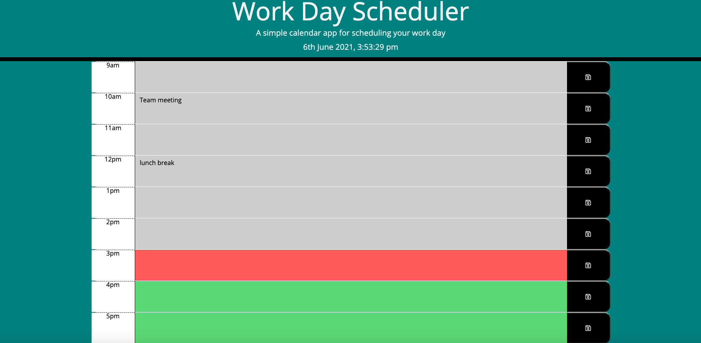

# Work Day Scheduler

## Task

A simple calendar application that allows a user to save events for each hour of the day by modifying starter code. This app will run in the browser and feature dynamically updated HTML and CSS powered by jQuery.


## User Story

```
AS AN employee with a busy schedule
I WANT to add important events to a daily planner
SO THAT I can manage my time effectively
```


## Usage

* This calendar displays work hours of the day between 9AM - 5PM.
* All of time blocks are color coded to indicate past(gray), present(red), or future(green).
* All time blocks have input fields and save button. 


### Screenshot of the homepage





## Review

You are required to submit BOTH of the following for review:

* The URL of the functional:

* The URL of the GitHub repository.:

- - -
© 2021 Betiel Mengesha. All Rights Reserved.
